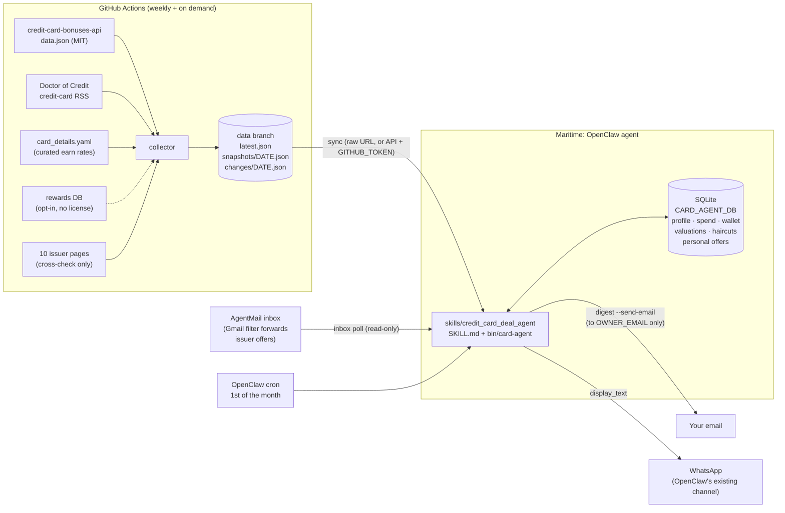

# Architecture

Two halves, $0/month: a **collector** on GitHub Actions that turns public data into
weekly snapshots, and an **agent** (an OpenClaw skill on Maritime) that holds your
private state and does the math.



Plain-text version:

```
public sources ──> [GitHub Actions collector] ──> data branch (snapshots + changes)
                                                        │ sync
AgentMail inbox ── inbox poll ──> [OpenClaw skill + SQLite] ──> digest ──> email (you only)
                                         │                          └────> WhatsApp (via OpenClaw)
                                   rank / compare / explain
```

## Layout

```
SKILL.md, AGENTS.md          OpenClaw skill contract (repo root = skill folder)
bin/card-agent               wrapper the agent calls; JSON out, last_response fallback
deploy/maritime_setup.sh     clone/update, install, test, first sync, write-protect
card_agent/
  models.py                  Pydantic v2: public tables + private state + defaults
  config.py                  Settings.from_env() (env vars only)
  collector/                 runs on Actions: python -m card_agent.collector run
    bonuses_api.py           source 1 fetch + normalize (ids, offers, credits)
    doc_rss.py               source 2: feed paging, classification, 35-day window
    seed.py                  config/card_details.yaml -> earn rates, FX, protections
    rewards_db.py            source 3 adapter (opt-in)
    issuer_pages.py          source 4: page facts + cross-check (shared with the probe)
    http.py                  polite client: honest UA, robots.txt, per-host throttle
    diff.py, run.py          diff vs previous snapshot; write the three files
  snapshot.py                sync from the data branch, local cache, DataView index
  store.py                   SQLite state (never committed)
  scoring.py                 EV math + pandas ranking, itemized breakdowns
  eligibility.py             issuer rules from config/eligibility_rules.yaml
  email_parse.py, inbox.py   AgentMail inbound: allowlist, regex extraction, phishing flags
  mailer.py, guardrails.py   digest email (owner only), card-number and link scrubbing
  digest.py                  monthly digest: WhatsApp + email renderings
  onboard.py, cli.py         setup and the `python -m card_agent` commands
config/                      rules, allowlists, seed data, example profile
scripts/probe_issuers.py     one-off issuer probe -> docs/FINDINGS.md
tests/                       offline pytest suite with recorded fixtures
```

## Data model

Public (snapshot): `Card`, `EarnRate`, `SignupOffer`, `Benefit`, `Protection`,
`NewsItem`, plus `EligibilityRule` (loaded from config). Bonuses (`offers`) and benefits
are separate tables because they change at different speeds.

Private (SQLite): `UserProfile`, `MonthlySpend`, `PointValuation`, `UsageHaircut`,
`WalletCard` (closed cards and product changes kept for issuer rules), `PersonalOffer`.

## Scoring (deterministic)

```
bonus value      = (bonus + extra points) × cpp + cash extras
earn value       = Σ_c spend_c × 12 × rate_c × cpp        (per-category caps; overflow at base rate)
benefits value   = Σ_i face_i × haircut_i                  (points-denominated benefits × cpp)
Year-1 EV        = bonus + earn + benefits − first-year fee
Steady-state EV  = earn + recurring benefits − annual fee
Marginal EV      = bonus + Σ_c spend_c × 12 × max(0, new ¢/$ − best held ¢/$)
                   + benefits whose kind you don't already have − fee
score            = h × marginal year-1 + (1 − h) × marginal steady,
                   h = 0.5 + 0.5 × (bonus_churning share of your goal weights)
```

Details that keep it honest:

- A card's rate for your "flights" spend is the best of its `flights` and `travel_general`
  rates (likewise hotels, portal, transit; online groceries also match groceries).
- Choice categories (Custom Cash, Customized Cash, Cash+, Amex Business Gold) are resolved
  to the options worth the most for *your* spend.
- Points from a card that can't transfer (e.g. Freedom Unlimited) are valued at 1.0¢ unless
  you hold a card in the same currency that unlocks transfers.
- Travel-dependent benefits count $0 if `trips_per_year` is 0; status you already hold
  counts $0; anniversary points count in full (no haircut).
- Also computed per card: vs a flat 2% card, bonus per $ of minimum spend, whether your
  normal spend reaches the minimum in the window, and eligibility with the rule that fired.
- Ranking is a pandas `sort_values` over score, then marginal year-1 EV, then goal fit.

## Security and guardrails

- No logins, no applications, no card numbers: there is no code path for the first two,
  and a Luhn check refuses to store anything that looks like a card number.
- The only outbound email is the digest, and `mailer.py` refuses any recipient other than
  `OWNER_EMAIL` / `DIGEST_TO_EMAIL`.
- Email and scraped text is untrusted: links and long numbers are stripped before storage,
  the WhatsApp digest never includes raw email text, links are never fetched, and the
  inbox is read-only (no labels, replies, or forwards).
- Secrets come only from environment variables. The state DB and caches live outside the
  repo, and the Maritime setup script write-protects the code so the agent can't edit it.
