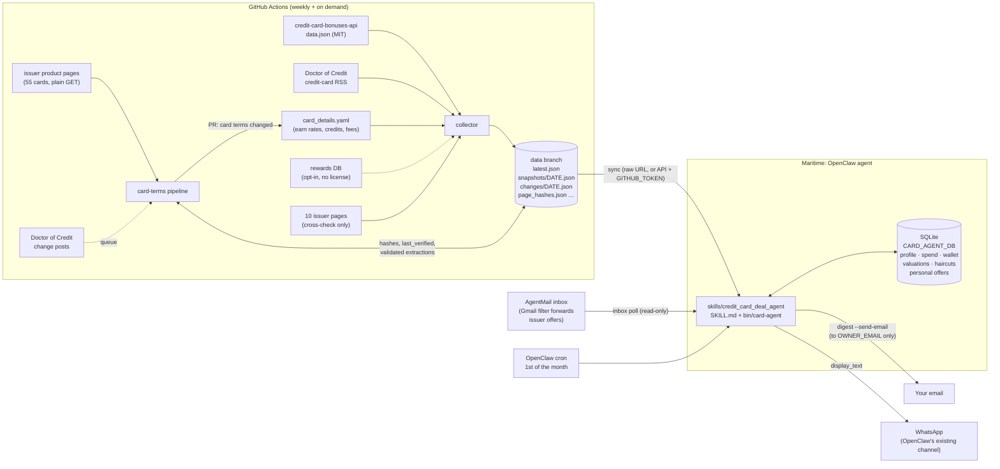

# Architecture

Three parts: a **collector** on GitHub Actions that turns public data into weekly
snapshots, a **card-terms pipeline** (also on Actions) that keeps
`config/card_details.yaml` in line with the issuers' product pages through reviewed PRs,
and an **agent** (an OpenClaw skill on Maritime) that holds your private state and does
the math. The only LLM use is the pipeline's extraction; scoring is deterministic.



Plain-text version:

```
public sources ──> [GitHub Actions collector] ──> data branch (snapshots + changes)
                                                        │ sync
AgentMail inbox ── inbox poll ──> [OpenClaw skill + SQLite] ──> digest ──> email (you only)
                                         │                          └────> WhatsApp (via OpenClaw)
                                   rank / compare / explain
```

## Card-terms pipeline

`config/card_details.yaml` used to be hand-compiled; now it is a generated artifact that
you review. `python -m card_agent.terms` (workflow `.github/workflows/card_terms.yml`):

```
card_sources.yaml ─> fetch page (1 GET, robots.txt, throttle) ─> visible text + JSON-LD
   │                                                              + __NEXT_DATA__ prose
   │                                                              ─> normalize ─> sha256
   │  no url ─> "manual" (hand values kept)          fetch fails ─> "fetch_failed"
   ▼
hash unchanged and not queued/forced ─> last_verified = today, no LLM call
hash changed / queued by RSS / --force
   ─> 1 LLM call (OpenAI Responses API, Structured Outputs from the Pydantic schema,
      no tools, page text marked as untrusted data)
   ─> deterministic validation (no LLM):
        card_name_on_page must be this card (multi-card pages) and appear on the page
        every value's evidence quote must be on the page (whitespace/case/® insensitive)
        the number must be in its quote, and an earn quote must name its category; a
          rate stated once over a list can use a heading + item quote pair (heading
          before the item, within 1,500 chars, no other rate in between)
        portal-only rates count as travel_portal; co-brand rates can't be hotels or
          flights (what a rate excludes, or the card's own points, don't count);
          "Select Travel" isn't travel in general; a capped base rate (other) must
          cover all purchases; a cap the quote mentions must be extracted; menu options
          outside the categories are left out
        benefit amounts are only lowered: coverage limits, per-use credits, rebate caps,
          credits unlocked by a spending threshold and airline status dollars get no $
          value, time-limited perks count once
        bounds: multiplier 0.5–15, fee 0–1000, credits 0–2000/yr; categories must map
          to the existing enum
        failed fields keep their current value and are listed in the validation report
   ─> "ok" (validated fields stored in data/card_terms.json) or "validation_failed"
   ─> merge with the current YAML (rows an extraction doesn't mention are kept: a
      removal can't be quoted) ─> diff ─> PR "card terms changed: …" from card-terms/auto
```

- **State** (data branch): `page_hashes.json` (hash, last_fetched, last_verified,
  source_status, issues per card), `card_terms.json` (validated fields with evidence),
  `terms_queue.json` (RSS-queued cards, seen posts).
- **Which diffs are proposed**: this run's extractions, plus every stored extraction while
  the auto PR is open (so it keeps its unmerged proposals). A closed PR is not reopened
  until the card's page changes again.
- **RSS trigger**: Doctor of Credit titles that name a tracked card (same matcher as the
  agent) and a change keyword queue the card; the weekly job re-extracts only queued cards.
- **Provenance**: the collector stamps each card with `source_status`, `last_verified` and
  `source_url` from `page_hashes.json`; `card_agent/freshness.py` turns them into the ⚠
  markers and the digest's data-health line (stale = not "ok", or not verified in 60 days).
- **Provider**: `card_agent/terms/llm.py` defines a one-method `Provider` protocol.
  OpenAI is implemented (`OPENAI_API_KEY`, `LLM_MODEL`, default `gpt-6-luna`);
  `LLM_PROVIDER=anthropic` is reserved. No key: extraction is skipped with a notice and
  the run still succeeds. A 401/403/404 stops further calls for the run.
- **Spend cap**: `MAX_RUN_COST_USD` (default $1.00). Before each call the pipeline adds
  up the run's estimated cost so far; once it reaches the cap, no new call starts and the
  remaining cards are retried next run. A model with no known price makes no calls.
- **Cost**: tokens and an estimated cost are in each run's job summary. A page is about
  5–20k input tokens; a full forced run of 55 pages is roughly $0.10–0.20 at gpt-6-luna prices,
  a normal month (only changed pages) a few cents.

## Agent layer (on Maritime)

The chat model follows `SKILL.md`; the tools do everything that must be exact.

```
person ──> chat model (SKILL.md: goal → decide → act → observe → evaluate)
              │  bin/card-agent <command>  →  {"display_text", "next", ...}
              ▼
   advise ─> Advisor loop (advisor.py)
               memory (store.py) → data freshness (snapshot.refresh) → rank (scoring.py)
               → handoff: Brief → Verifier subagent (verifier.py) → Report
               → accept / reject and try the next / revise the plan once / ask the person
               → save the pick to memory → stop
   every command ─> trace.jsonl (trace.py)  ─> `trace` replays it
```

- **`next`**: each result tells the chat model what to do: `stop`, `ask_user`, `run` a
  recovery command once, or `fix_command`. SKILL.md adds the stopping conditions (4
  commands per message, same failure twice) and the ask-a-person conditions.
- **Verifier**: gets a `Brief` (card, claimed values, fee limit, total spend, score band,
  wallet dates) and nothing else; returns pass/warn/fail with evidence per check.
- **Memory**: SQLite tables `hidden` (cards and issuers to skip, with reason) and
  `recommendation` (past picks) join the profile, spend, wallet and inbox tables.
- **Recovery**: `snapshot.refresh` retries transient errors, switches between
  raw.githubusercontent.com and the contents API, validates before an atomic cache write,
  and falls back to the saved copy; `matching.suggest` handles typos.
- **Presentation**: `present.py` (emoji, labels, Unicode bars, the markup lint) and
  `views.py` (each command's text). The digest email gets a plain-text part and an HTML
  part with a bar chart. Links come only from `links.py`: curated issuer pages, feed links
  on the issuer's own domain, and `config/official_links.yaml`.

See [EVALUATION.md](EVALUATION.md) for the evidence and a baseline vs improved run.

## Layout

```
SKILL.md, AGENTS.md          OpenClaw skill contract (repo root = skill folder)
bin/card-agent               wrapper the agent calls; JSON out, last_response fallback
deploy/maritime_setup.sh     clone/update, install, test, first sync, write-protect
card_agent/
  models.py                  Pydantic v2: public tables + private state + defaults
  config.py                  Settings.from_env() (env vars only)
  collector/                 runs on Actions: python -m card_agent.collector run
    bonuses_api.py           source 1 fetch + normalize (ids, offers, credits)
    doc_rss.py               source 2: feed paging, classification, 35-day window
    seed.py                  config/card_details.yaml -> earn rates, fees, credits, FX, protections
    rewards_db.py            source 3 adapter (opt-in)
    issuer_pages.py          source 4: page facts + cross-check (shared with the probe)
    http.py                  polite client: honest UA, robots.txt, per-host throttle
    diff.py, run.py          diff vs previous snapshot; write the three files
  terms/                     card-terms pipeline: python -m card_agent.terms run|rss|smoke
    sources.py               config/card_sources.yaml; card-name normalization
    page.py                  page text (visible + embedded JSON), hash, fetch
    schema.py                LLM output schema (evidence on every field), CardTerms
    llm.py, extract.py       provider interface (OpenAI), prompt, one call per page
    validate.py              deterministic validation and merge (no LLM)
    details.py               card_details.yaml writer, apply, diff
    state.py, rss_trigger.py data-branch state; Doctor of Credit trigger
    pipeline.py, report.py   one run; job summary, PR body, smoke and bootstrap reports
  freshness.py               staleness markers and data-health line
  snapshot.py                sync with retry/endpoint switch/saved-copy fallback, DataView
  store.py                   SQLite state and memory (never committed)
  scoring.py                 EV math + pandas ranking, itemized breakdowns, wallet_rates
  eligibility.py             issuer rules from config/eligibility_rules.yaml
  advisor.py                 the advise loop (goal → … → stop/ask), recorded step by step
  verifier.py                the Verifier subagent: bounded brief in, report out
  trace.py                   trace.jsonl: one line per command, advise's steps included
  links.py                   official apply and pre-approval links only
  credit.py                  credit-health check (5/24, account age, utilization, tips)
  present.py, views.py       chat-ready text: emoji, bars, labels, markup lint
  email_parse.py, inbox.py   AgentMail inbound: allowlist, regex extraction, phishing flags
  mailer.py, guardrails.py   digest email (owner only), card-number and link scrubbing
  digest.py                  monthly digest: chat text, plain-text and HTML email
  onboard.py, cli.py         setup and the `python -m card_agent` commands
config/                      rules, allowlists, seed data, example profile
scripts/probe_issuers.py     one-off issuer probe -> docs/FINDINGS.md
scripts/bootstrap_extract.py extraction vs hand YAML -> docs/BOOTSTRAP_DIFF.md
scripts/eval_agent.py        baseline vs improved agent evaluation -> docs/EVALUATION.md
tests/                       offline pytest suite with recorded fixtures
```

## Data model

Public (snapshot): `Card`, `EarnRate`, `SignupOffer`, `Benefit`, `Protection`,
`NewsItem`, plus `EligibilityRule` (loaded from config). Bonuses (`offers`) and benefits
are separate tables because they change at different speeds.

Private (SQLite): `UserProfile` (including an optional self-reported score band and
total credit limit), `MonthlySpend`, `PointValuation`, `UsageHaircut`, `WalletCard`
(closed cards and product changes kept for issuer rules), `PersonalOffer`, plus the
`hidden` and `recommendation` tables and the digest log.

## Scoring (deterministic)

```
bonus value      = (bonus + extra points) × cpp + cash extras
earn value       = Σ_c spend_c × 12 × rate_c × cpp        (per-category caps; overflow at base rate)
benefits value   = Σ_i face_i × haircut_i                  (points-denominated benefits × cpp)
Year-1 EV        = bonus + earn + benefits − first-year fee
Steady-state EV  = earn + recurring benefits − annual fee
Marginal EV      = bonus + Σ_c spend_c × 12 × max(0, new ¢/$ − best held ¢/$)
                   + benefits whose kind you don't already have − fee
score            = h × marginal year-1 + (1 − h) × marginal steady,
                   h = 0.5 + 0.5 × (bonus_churning share of your goal weights)
```

Details that keep it honest:

- A card's rate for your "flights" spend is the best of its `flights` and `travel_general`
  rates (likewise hotels, portal, transit; online groceries also match groceries).
- Choice categories (Custom Cash, Customized Cash, Cash+, Amex Business Gold) are resolved
  to the options worth the most for *your* spend.
- Points from a card that can't transfer (e.g. Freedom Unlimited) are valued at 1.0¢ unless
  you hold a card in the same currency that unlocks transfers.
- Travel-dependent benefits count $0 if `trips_per_year` is 0; status you already hold
  counts $0; anniversary points count in full (no haircut).
- Also computed per card: vs a flat 2% card, bonus per $ of minimum spend, whether your
  normal spend reaches the minimum in the window, and eligibility with the rule that fired.
- Ranking is a pandas `sort_values` over score, then marginal year-1 EV, then goal fit.

## Security and guardrails

- No logins, no applications, no card numbers: there is no code path for the first two,
  and a Luhn check refuses to store anything that looks like a card number.
- The only outbound email is the digest, and `mailer.py` refuses any recipient other than
  `OWNER_EMAIL` / `DIGEST_TO_EMAIL`.
- Email and scraped text is untrusted: links and long numbers are stripped before storage,
  the WhatsApp digest never includes raw email text, links are never fetched, and the
  inbox is read-only (no labels, replies, or forwards).
- Issuer page text reaches the LLM only as delimited data, with a system prompt that says
  to ignore any instructions in it; the model has no tools, and nothing it returns is
  used unless its quote is on the page. Its output only ever becomes a PR you review.
- Secrets come only from environment variables. The state DB and caches live outside the
  repo, and the Maritime setup script write-protects the code so the agent can't edit it.
